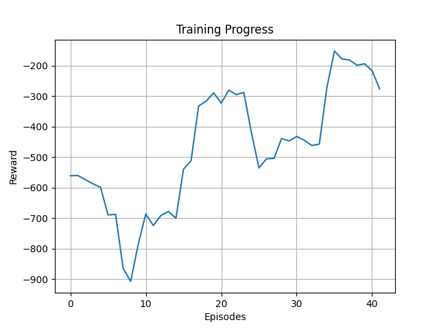
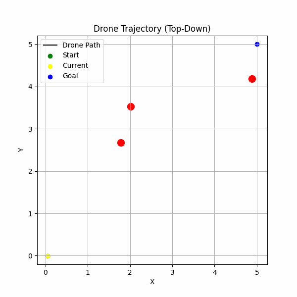
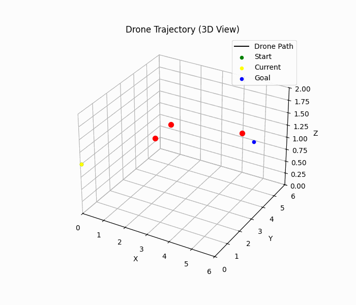

# 🚁 Drone Navigation with Reinforcement Learning

This project explores deep reinforcement learning (RL) techniques for autonomous drone navigation in a 3D simulated world using **PyBullet**. The goal is to teach a drone to navigate from a starting point to a target location while avoiding randomly placed obstacles — using only LiDAR-style sensing and physical feedback.

---

## 🎯 Goals

- Build a fully custom drone control environment in **PyBullet**
- Train and compare several RL algorithms:
  - ✅ Deep Q-Network (DQN)
  - ✅ Deep Deterministic Policy Gradient (DDPG)
  - 🧪 Proximal Policy Optimization (PPO)
  - 🧪 (Optional) Backpropagation Through Time (BPTT)
- Evaluate and visualize performance based on:
  - Episode rewards
  - Collision frequency
  - Goal-reaching success rate
  - Learning efficiency

---

## 🧠 Core Features

- Continuous control using DDPG and PyBullet physics
- Dynamic obstacles (randomized on each reset)
- LiDAR-based observations for realistic sensing
- Reward shaping for progress, smoothness, and collision avoidance
- Visualization of flight paths and training metrics
- `.gif` exports of drone trajectories

---

## 🧰 Tech Stack

- **Python 3**
- **PyBullet** (for drone simulation)
- **TensorFlow** (DDPG & PPO agents)
- **NumPy**, **Matplotlib**
- **OpenAI Gym** (custom environment wrapper)

---

## 📁 Project Structure

drone-ai/
├── agents/                  # DDPG and PPO agents
│   ├── ddpg_agent.py
│   └── ppo_agent.py
│
├── env/                     # Custom Gym-like PyBullet environment
│   └── drone_env.py
│
├── experiments/             # Training, testing, and visualization scripts
│   ├── train_ddpg.py
│   ├── train_ppo.py
│   ├── test_env.py
│   ├── visualize_agent.py
│   └── models/
│       ├── best_ddpg_actor.h5
│       ├── best_ddpg_critic.h5
│       ├── reward_curve.png
│       ├── trajectory.png
│       └── trajectory.gif
│
├── utils/                   # Optional: Replay buffer and helper tools
│   └── per_buffer.py
│
└── README.md                # Project overview and documentation

---

## 📊 Status

- [x] Repo initialized
- [x] Environment implemented
- [x] DQN agent implemented (discrete control)
- [x] ✅ DDPG agent (continuous control)
- [ ] PPO agent in progress
- [ ] BPTT agent (optional exploration)
- [x] Trajectory visualizer + `.gif` exporter
- [ ] Evaluation script and metrics dashboard

---

## 📽️ Sample Output

| Training Progress | Drone Flight Path |
|-------------------|-------------------|
|  |  |

## 📽️ Sample Drone Trajectory
Work in Progress, samples are not fully optimised but seems to be improving.

---

## 👩‍💻 Author

Made with ❤️ by **Dr Mahrad Pisheh Var**
_Reinforcement Learning Enthusiast_
**Let the drones fly smarter.**

---

## 📜 License

MIT License

Copyright (c) 2025 Mahrad Pisheh Var
